# Kidney_Disease_Classification
End to End Kidney Disease Classification model using MLFlow, DVC, DagsHub, AWS, Github Actions, Docker

## Kidney-Disease-Classification-MLflow-DVC

## Workflows

1. Update config.yaml
2. Update secrets.yaml [Optional]
3. Update params.yaml
4. Update the entity
5. Update the configuration manager in src config
6. Update the components
7. Update the pipeline 
8. Update the main.py
9. Update the dvc.yaml
10. app.py

# How to run?
### STEPS:

Clone the repository

```bash
https://github.com/Jkanishkha0305/Kidney_Disease_Classification
```
### STEP 01 - Create a conda environment after opening the repository

```bash
conda create -n kidney python=3.8 -y
```

```bash
conda activate kidney
```


### STEP 02 - install the requirements
```bash
pip install -r requirements.txt
```

### STEP 03 - collect dataset
Dataset : Kaggel [CT KIDNEY DATASET: Normal-Cyst-Tumor and Stone]    
Dataset Link : https://www.kaggle.com/datasets/nazmul0087/ct-kidney-dataset-normal-cyst-tumor-and-stone  
Size : 1.66 GB   
Files : 12.4k Files


### Step 04 - prepare base model 
Keras API link : https://keras.io/api/applications/  
Model Chosen : VGG16   
Model link : https://keras.io/api/applications/vgg/#vgg16-function   
Image size : 244x244x3


```bash
# Finally run the following command
python main.py
```

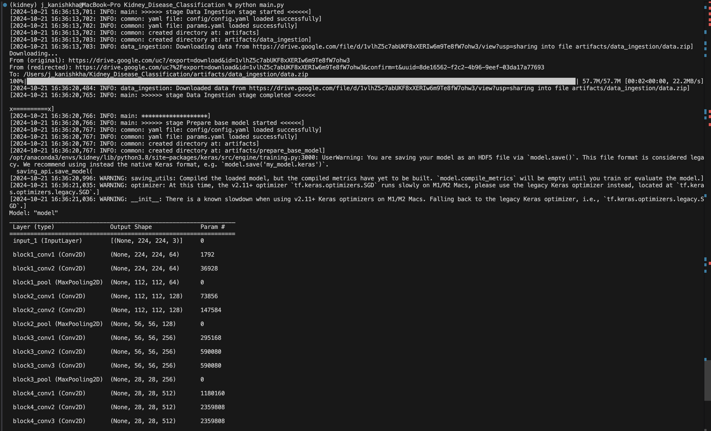

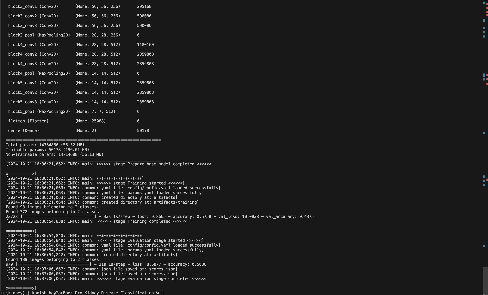

```bash
# Finally run the following command
python app.py
```

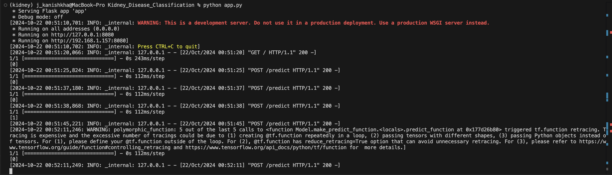

Now,
```bash
open up you local host and port
```
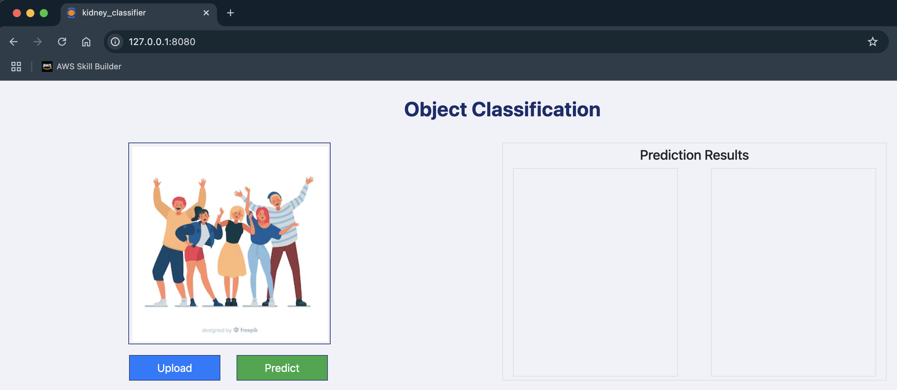

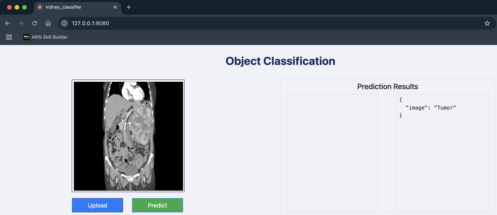

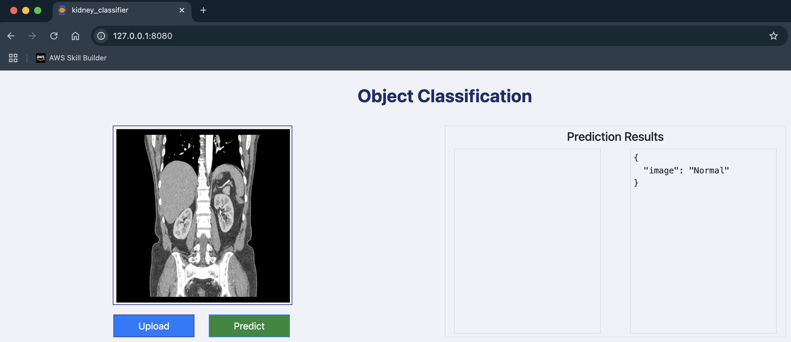

## MLflow

- [Documentation](https://mlflow.org/docs/latest/index.html)

- [MLflow tutorial](https://youtu.be/qdcHHrsXA48?si=bD5vDS60akNphkem)

- [MLflow Model Registry Docs](https://mlflow.org/docs/latest/model-registry.html#api-workflow)

##### cmd
- mlflow ui

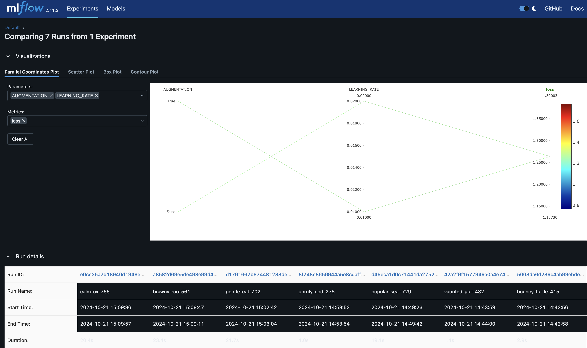

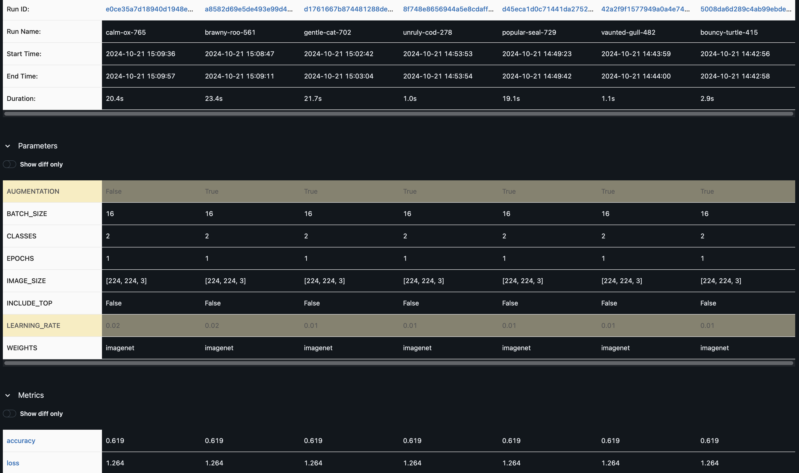


### dagshub
[dagshub](https://dagshub.com/)

```bash
import dagshub
dagshub.init(repo_owner='Jkanishkha0305', repo_name='Kidney_Disease_Classification', mlflow=True)

import mlflow
with mlflow.start_run():
  mlflow.log_param('parameter name', 'value')
  mlflow.log_metric('metric name', 1)
```  


MLFLOW_TRACKING_URI=https://dagshub.com/Jkanishkha0305/Kidney_Disease_Classification.mlflow \
MLFLOW_TRACKING_USERNAME=entbappy \  
MLFLOW_TRACKING_PASSWORD=6bd16d7f5ee713eba8329fb353c637dc8de93b55 \  
python script.py

Run this to export as env variables:

```bash

export MLFLOW_TRACKING_URI=https://dagshub.com/Jkanishkha0305/Kidney_Disease_Classification.mlflow

export MLFLOW_TRACKING_USERNAME=Jkanishkha0305

export MLFLOW_TRACKING_PASSWORD=6bd16d7f5ee713eba8329fb353c637dc8de93b55

```

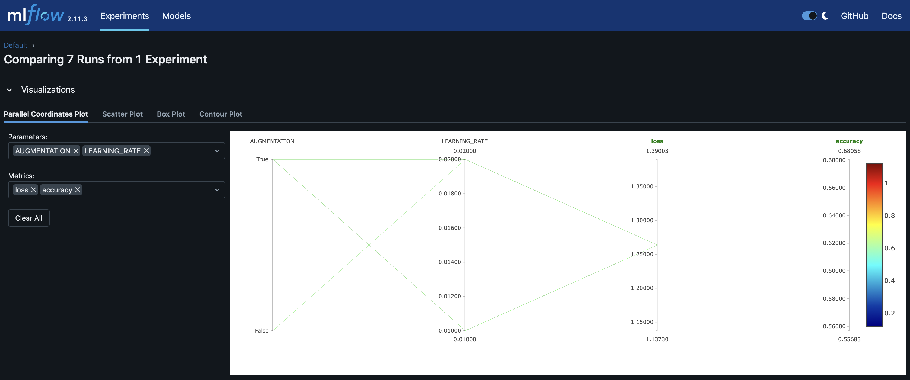

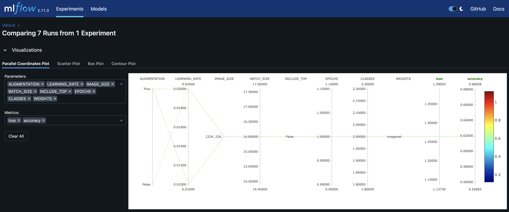

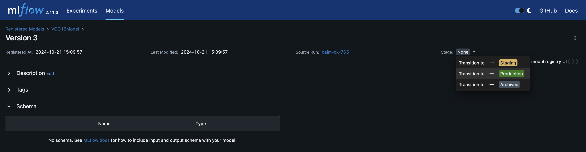


### DVC cmd
[DVC](https://dvc.org/doc)  
1. dvc init
2. dvc repro
3. dvc dag

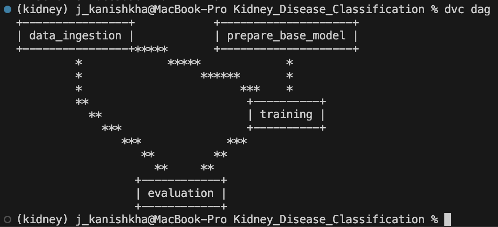


## About MLflow & DVC

MLflow

 - Its Production Grade
 - Trace all of your expriements
 - Logging & taging your model


DVC 

 - Its very lite weight for POC only
 - lite weight expriements tracker
 - It can perform Orchestration (Creating Pipelines)


# AWS-CICD-Deployment-with-Github-Actions

## 1. Login to AWS console.

## 2. Create IAM user for deployment

	#with specific access

	1. EC2 access : It is virtual machine

	2. ECR: Elastic Container registry to save your docker image in aws


	#Description: About the deployment

	1. Build docker image of the source code

	2. Push your docker image to ECR

	3. Launch Your EC2 

	4. Pull Your image from ECR in EC2

	5. Lauch your docker image in EC2

	#Policy:

	1. AmazonEC2ContainerRegistryFullAccess

	2. AmazonEC2FullAccess

	
## 3. Create ECR repo to store/save docker image
    - Save the URI: 729852511714.dkr.ecr.us-east-1.amazonaws.com/kidney

	
## 4. Create EC2 machine (Ubuntu) 

## 5. Open EC2 and Install docker in EC2 Machine:
	
	
	#optinal

	sudo apt-get update -y

	sudo apt-get upgrade
	
	#required

	curl -fsSL https://get.docker.com -o get-docker.sh

	sudo sh get-docker.sh

	sudo usermod -aG docker ubuntu

	newgrp docker

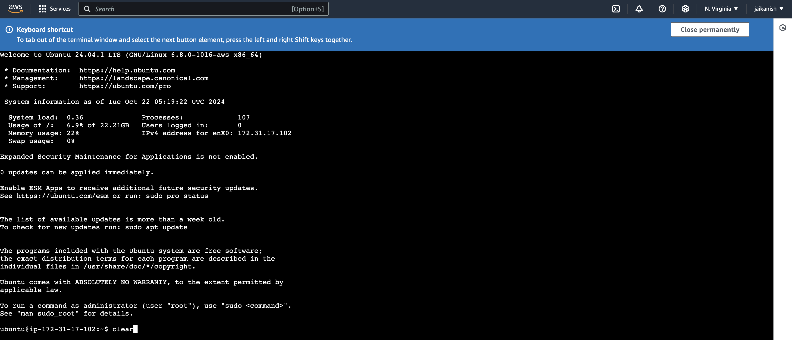

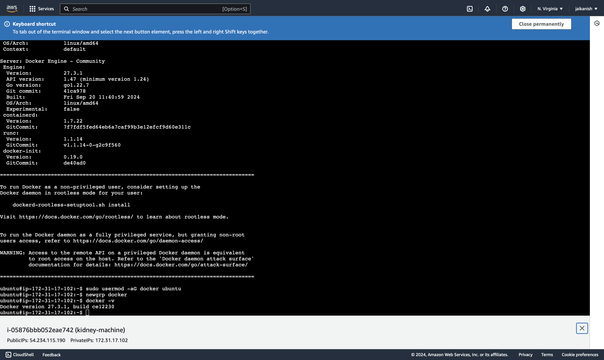
	
# 6. Configure EC2 as self-hosted runner:
    settings>actions>runner>new self hosted runner> choose os> then run command one by one

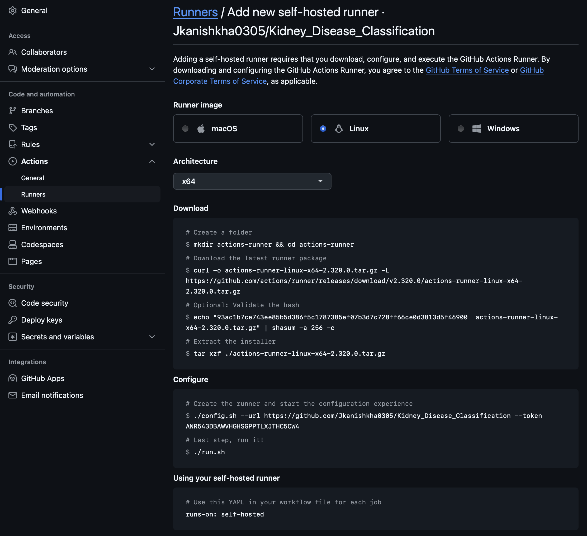

# 7. Setup github secrets:
    settings>secrets and variables>action>add new repository secret

    (from the access key .csv that was downloaded)
    AWS_ACCESS_KEY_ID=

    AWS_SECRET_ACCESS_KEY=

    AWS_REGION = us-east-1

    AWS_ECR_LOGIN_URI = 729852511714.dkr.ecr.us-east-1.amazonaws.com

    ECR_REPOSITORY_NAME = kidney

